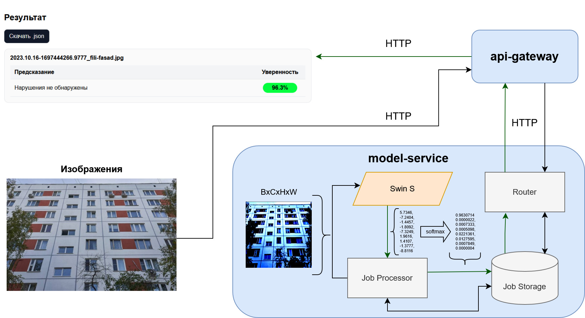

[facade-app.chichimoid.com](https://facade-app.chichimoid.com)
### Facade
Модель и веб-приложение для классификации нарушений в городском благоустройстве по фотографиям. \
Приложение собирается через docker compose up, в папке research итоговые метрики и хаотичные исследовательские данные. 

#### Перечень возможных нарушений включает:
•Нарушение состояния фасадов нежилых зданий и сооружений \
•Нарушение состояния фасада жилых зданий \
•Нарушение содержания дорог, МАФов, остановок, … \
•Нарушение содержания объектов ЦОДД \
•Нарушение содержания объектов Гормост \
•Неудовлетворительное содержание ОЛХ \
•Наличие сухостойных деревьев \
•Наличие подтоплений
